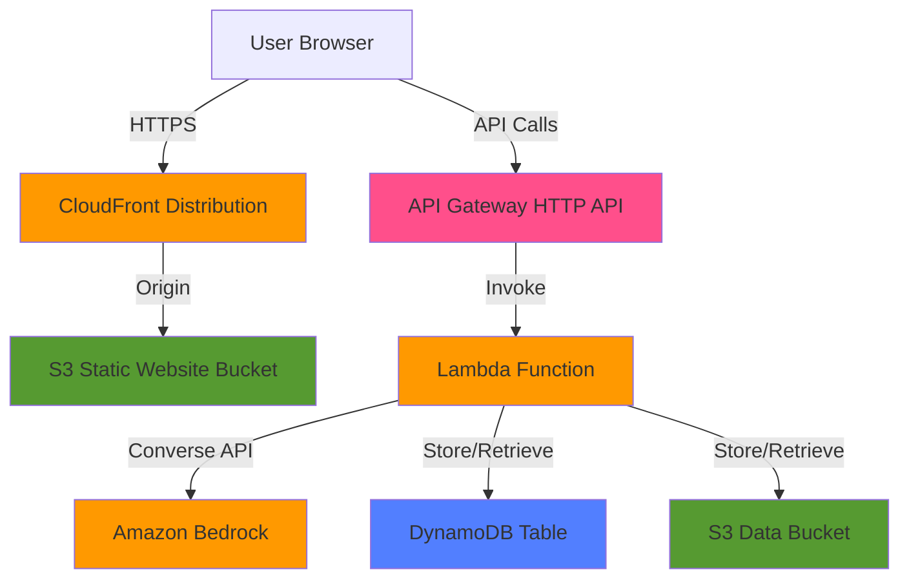

# Design Document: AccessFlow Core MVP

## Overview

AccessFlow Core MVP is a serverless web application that helps disabled and neurodivergent job seekers create tailored job applications. The system uses a React frontend served via CloudFront, AWS Lambda backend functions, and Amazon Bedrock AI services to generate empathetic, capability-focused application materials.

### Key Design Goals

- **Accessibility-first**: WCAG-aware UI with keyboard navigation, screen reader support, and high contrast
- **Privacy-by-default**: Session-based storage without authentication, minimal PII retention
- **Free-Tier optimized**: Serverless architecture designed to operate within AWS Free Tier limits
- **Low friction**: Simple input flow with no account creation required
- **Empathetic AI**: Uses Claude models via Bedrock Converse API for human-centered content generation

### High-Level Architecture

The application follows a serverless architecture pattern:

```
User Browser (React SPA)
    ↓ HTTPS
CloudFront CDN
    ↓
S3 Static Website Bucket
    
User Browser
    ↓ HTTPS API calls
API Gateway (HTTP API)
    ↓
Lambda Functions (Node.js)
    ↓
├─→ Amazon Bedrock (Converse API)
├─→ DynamoDB (Application Analysis storage)
└─→ S3 (Input data storage)
```

## Architecture

### Component Overview

The system consists of four primary layers:

1. **Presentation Layer**: React SPA served via CloudFront/S3
2. **API Layer**: API Gateway HTTP API with CORS support
3. **Application Layer**: Node.js Lambda functions for business logic
4. **Data Layer**: DynamoDB for structured data, S3 for text storage, Bedrock for AI generation

### Deployment Architecture



### Security Architecture

- **IAM Roles**: Each Lambda function has a dedicated execution role with least privilege permissions
- **S3 Bucket Policies**: Data bucket denies all public access; static bucket allows CloudFront OAI only
- **API Gateway**: HTTPS-only endpoints with CORS configured for frontend domain
- **Encryption**: S3 server-side encryption (SSE-S3), DynamoDB encryption at rest enabled
- **Input Validation**: All user inputs validated before processing to prevent injection attacks

### Scalability Considerations

- **Lambda Concurrency**: Default account limits (1000 concurrent executions) sufficient for MVP
- **DynamoDB**: On-demand billing mode auto-scales with traffic
- **API Gateway**: Throttling configured to prevent Free Tier overages (10,000 requests/month target)
- **CloudFront**: Global edge caching reduces origin requests

## Components and Interfaces

### Frontend Component (React SPA)

**Technology**: React 18+ with functional components and hooks

**Key Modules**:

- `InputForm`: Collects job description, resume text, and user preferences
- `ResultsDisplay`: Shows generated application analysis materials
- `ErrorBoundary`: Catches and displays errors accessibly
- `AccessibilityProvider`: Manages focus, ARIA announcements, keyboard navigation

**State Management**: React Context API for global state (session ID, loading states, error messages)

**Routing**: React Router for navigation between input form and results pages

**API Client**: Axios or Fetch API for HTTP requests to API Gateway

**Accessibility Features**:
- Semantic HTML with proper heading hierarchy
- ARIA labels and live regions for dynamic content
- Keyboard navigation with visible focus indicators
- High contrast color scheme (WCAG AA minimum)
- Form validation with accessible error messages

**Interface to Backend**:

```typescript
// POST /api/analyze
interface AnalyzeRequest {
  jobDescription: string;
  resumeText: string;
  preferences: {
    workStyle: string;
    accommodations: string;
    disclosureFlag: boolean;
    includeInterviewPrep: boolean;
  };
}

interface AnalyzeResponse {
  sessionId: string;
  analysis: {
    jobSummary: string;
    positioningSummary: string;
    coverLetter: string;
    interviewPrep?: {
      questions: string[];
      answers: string[];
      accommodationScript?: string;
    };
  };
}

interface ErrorResponse {
  error: string;
  message: string;
}
```

### Backend Component (Lambda Functions)

**Technology**: Node.js 22.x runtime

**Primary Function**: `analyzeApplication`

**Handler Flow**:
1. Validate incoming request body
2. Generate cryptographically random session ID
3. Store input data to S3
4. Call Bedrock Converse API for each generation task
5. Aggregate results into Application_Analysis object
6. Store analysis in DynamoDB
7. Return session ID and analysis to frontend

**Bedrock Integration**:
- **Service**: Amazon Bedrock Converse API
- **Region**: us-east-1
- **Model**: Claude Haiku 4.5 or Sonnet (cost-optimized)
- **API**: `converse` method with message-based interface

**Error Handling**:
- Bedrock throttling: Exponential backoff with max 3 retries
- Service unavailable: Return 503 with clear error message
- Validation errors: Return 400 with field-specific messages
- Internal errors: Return 500 with generic message (no sensitive data)

**IAM Permissions Required**:
```json
{
  "Version": "2012-10-17",
  "Statement": [
    {
      "Effect": "Allow",
      "Action": [
        "bedrock:InvokeModel",
        "bedrock:InvokeModelWithResponseStream"
      ],
      "Resource": "arn:aws:bedrock:us-east-1::foundation-model/anthropic.claude-*"
    },
    {
      "Effect": "Allow",
      "Action": [
        "dynamodb:PutItem",
        "dynamodb:GetItem"
      ],
      "Resource": "arn:aws:dynamodb:*:*:table/AccessFlowApplications"
    },
    {
      "Effect": "Allow",
      "Action": [
        "s3:PutObject",
        "s3:GetObject"
      ],
      "Resource": "arn:aws:s3:::accessflow-data-bucket/*"
    }
  ]
}
```

### API Gateway Component

**Type**: HTTP API (lower cost than REST API)

**Endpoints**:
- `POST /api/analyze`: Main endpoint for application analysis
- `GET /api/health`: Health check endpoint

**Configuration**:
- CORS enabled for frontend domain
- Request throttling: 100 requests/second burst, 50 steady state
- Request timeout: 29 seconds (Lambda max is 30s)
- Request size limit: 6 MB (accommodates large resumes)

**Integration**: Lambda proxy integration with `analyzeApplication` function

### Data Storage Components

#### DynamoDB Table: `AccessFlowApplications`

**Primary Key**: `sessionId` (String)

**Attributes**:
```typescript
interface ApplicationRecord {
  sessionId: string;              // Partition key
  createdAt: number;              // Unix timestamp
  jobSummary: string;
  positioningSummary: string;
  coverLetter: string;
  interviewQuestions?: string[];
  interviewAnswers?: string[];
  accommodationScript?: string;
  s3InputKey: string;             // Reference to S3 stored inputs
}
```

**Configuration**:
- Billing mode: On-demand (auto-scaling)
- Encryption: AWS managed keys (default)
- TTL: Optional 30-day expiration on `createdAt` field for privacy

#### S3 Bucket: `accessflow-data-bucket`

**Purpose**: Store job descriptions and resume text

**Object Key Pattern**: `inputs/{sessionId}/job-description.txt` and `inputs/{sessionId}/resume.txt`

**Configuration**:
- Block all public access: Enabled
- Versioning: Disabled (not needed for MVP)
- Encryption: SSE-S3 (AES-256)
- Lifecycle policy: Delete objects after 30 days

#### S3 Bucket: `accessflow-static-website`

**Purpose**: Host React SPA static files

**Configuration**:
- Static website hosting: Enabled
- Public access: Via CloudFront OAI only
- Encryption: SSE-S3
- CORS: Configured for API Gateway domain

### Amazon Bedrock Integration

**Model Selection**: Claude Haiku 4.5 (cost-optimized) or Claude 3.5 Sonnet (quality-optimized)

**Converse API Usage**:

```typescript
import { BedrockRuntimeClient, ConverseCommand } from "@aws-sdk/client-bedrock-runtime";

const client = new BedrockRuntimeClient({ region: "us-east-1" });

async function generateJobSummary(jobDescription: string): Promise<string> {
  const command = new ConverseCommand({
    modelId: "anthropic.claude-haiku-4-5-20251001-v1:0",
    messages: [
      {
        role: "user",
        content: [
          {
            text: `You are helping a neurodivergent job seeker understand a job posting. 
            Provide a clear, empathetic summary in plain English that explains what the role 
            really involves day-to-day. Focus on concrete tasks and expectations.
            
            Job Description:
            ${jobDescription}`
          }
        ]
      }
    ],
    inferenceConfig: {
      maxTokens: 1000,
      temperature: 0.7
    }
  });
  
  const response = await client.send(command);
  return response.output.message.content[0].text;
}
```

**Prompt Engineering Strategy**:
- **Job Summary**: Emphasize plain English, empathy, concrete examples
- **Positioning**: Focus on capability matching, strength identification
- **Cover Letter**: Tailor to disclosure preference, highlight relevant experience
- **Interview Prep**: Generate realistic questions, provide structured answer frameworks

**Cost Optimization**:
- Use Haiku model for summaries (lower cost)
- Use Sonnet only if quality issues arise
- Set appropriate max token limits per generation type
- Implement caching for identical inputs (future enhancement)

## Data Models

### Session Identifier

```typescript
type SessionId = string; // 32-character hex string (128 bits entropy)

function generateSessionId(): SessionId {
  const bytes = crypto.randomBytes(16);
  return bytes.toString('hex');
}
```

### User Input Model

```typescript
interface UserInput {
  jobDescription: string;        // Required, max 10,000 chars
  resumeText: string;            // Required, max 20,000 chars
  preferences: UserPreferences;
}

interface UserPreferences {
  workStyle: string;             // Free text, max 1,000 chars
  accommodations: string;        // Free text, max 1,000 chars
  disclosureFlag: boolean;       // Whether to include disability info
  includeInterviewPrep: boolean; // Whether to generate interview materials
}
```

### Application Analysis Model

```typescript
interface ApplicationAnalysis {
  sessionId: SessionId;
  createdAt: number;             // Unix timestamp in milliseconds
  jobSummary: string;            // Plain English job summary
  positioningSummary: string;    // Capability-focused positioning
  coverLetter: string;           // Tailored cover letter
  interviewPrep?: InterviewPrep; // Optional interview materials
  s3InputKey: string;            // Reference to stored inputs
}

interface InterviewPrep {
  questions: string[];           // Likely interview questions
  answers: string[];             // Suggested answers
  accommodationScript?: string;  // Optional accommodation request script
}
```

### Error Model

```typescript
interface ApiError {
  error: string;                 // Error type: "ValidationError", "ServiceError", etc.
  message: string;               // User-friendly error message
  details?: Record<string, string>; // Optional field-specific errors
}
```

### DynamoDB Schema

```typescript
// DynamoDB item structure
interface DynamoDBApplicationRecord {
  sessionId: { S: string };              // Partition key
  createdAt: { N: string };              // Sort key (optional)
  jobSummary: { S: string };
  positioningSummary: { S: string };
  coverLetter: { S: string };
  interviewQuestions?: { L: Array<{ S: string }> };
  interviewAnswers?: { L: Array<{ S: string }> };
  accommodationScript?: { S: string };
  s3InputKey: { S: string };
  ttl?: { N: string };                   // Optional TTL for auto-deletion
}
```

### S3 Object Structure

```
accessflow-data-bucket/
  inputs/
    {sessionId}/
      job-description.txt
      resume.txt
      preferences.json
```

## Correctness Properties

*A property is a characteristic or behavior that should hold true across all valid executions of a system—essentially, a formal statement about what the system should do. Properties serve as the bridge between human-readable specifications and machine-verifiable correctness guarantees.*

### Property 1: Input Validation Rejects Empty Required Fields

*For any* form submission, if either Job_Description or Resume_Text is empty or contains only whitespace, the frontend validation should reject the submission and prevent the API call.

**Validates: Requirements 1.3, 12.4**

### Property 2: Valid Inputs Trigger API Calls

*For any* form submission with non-empty Job_Description and Resume_Text, the frontend should send a POST request to the API Gateway endpoint.

**Validates: Requirements 1.4**

### Property 3: All Form Controls Have Visible Labels

*For any* form control (input, textarea, checkbox) in the application, there should exist an associated visible label element that describes the control.

**Validates: Requirements 1.6, 13.1**

### Property 4: All Interactive Elements Are Keyboard Accessible

*For any* interactive element (buttons, inputs, links) in the application, the element should be reachable and operable using only keyboard navigation (Tab, Enter, Space).

**Validates: Requirements 1.5, 13.2**

### Property 5: Session ID Generation Has Sufficient Entropy

*For any* application analysis request, the generated Session_ID should be a cryptographically random string with at least 128 bits of entropy (minimum 32 hexadecimal characters).

**Validates: Requirements 2.1, 2.2**

### Property 6: Session ID Appears in Response and Storage

*For any* successful application analysis, the Session_ID should be included in the API response and used as the partition key for the DynamoDB record.

**Validates: Requirements 2.3, 2.4, 8.2**

### Property 7: Input Data Is Stored in S3 with Session-Based Keys

*For any* Job_Description and Resume_Text received by the backend, the data should be stored in S3 with object keys that include the Session_ID (e.g., `inputs/{sessionId}/job-description.txt`).

**Validates: Requirements 3.1, 3.3**

### Property 8: Application Analysis Contains All Required Fields

*For any* successful application analysis response, the response should contain non-empty values for jobSummary, positioningSummary, and coverLetter fields.

**Validates: Requirements 4.4, 5.3, 6.4**

### Property 9: Interview Prep Included When Requested

*For any* application analysis request where includeInterviewPrep is true, the response should contain an interviewPrep object with questions and answers arrays.

**Validates: Requirements 7.1, 7.5**

### Property 10: Interview Answers Match Questions Count

*For any* generated interview prep materials, the number of answers should equal the number of questions.

**Validates: Requirements 7.3**

### Property 11: Accommodation Script Generated When Accommodations Specified

*For any* application analysis request where the accommodations field is non-empty and includeInterviewPrep is true, the interviewPrep object should contain an accommodationScript field.

**Validates: Requirements 7.4**

### Property 12: Disclosure Flag Controls Disability Mentions

*For any* cover letter generated with disclosureFlag set to false, the cover letter text should not contain explicit disability-related terms (e.g., "disability", "disabled", "accommodation", "ADA").

**Validates: Requirements 6.2**

### Property 13: Application Analysis Stored in DynamoDB

*For any* completed application analysis, a record should be stored in DynamoDB with the sessionId as the partition key and all generated content fields populated.

**Validates: Requirements 8.1**

### Property 14: DynamoDB Records Exclude Sensitive PII

*For any* DynamoDB record stored by the application, the record should not contain email address fields or explicit disability label fields.

**Validates: Requirements 8.3**

### Property 15: Sensitive Data Not Logged

*For any* log entry generated by the backend, the log should not contain Job_Description, Resume_Text, or User_Preferences content.

**Validates: Requirements 12.5**

### Property 16: Successful Response Triggers Navigation

*For any* successful API response containing an Application_Analysis, the frontend should navigate to the results page.

**Validates: Requirements 9.1**

### Property 17: Results Page Displays Core Analysis Fields

*For any* Application_Analysis displayed on the results page, the page should render visible content for jobSummary, positioningSummary, and coverLetter.

**Validates: Requirements 9.2**

### Property 18: Interview Prep Conditionally Displayed

*For any* Application_Analysis with an interviewPrep object, the results page should display the interview questions, answers, and accommodation script (if present).

**Validates: Requirements 9.3**

### Property 19: Text Contrast Meets WCAG Standards

*For any* text element in the application, the color contrast ratio between text and background should meet WCAG AA standards (minimum 4.5:1 for normal text, 3:1 for large text).

**Validates: Requirements 9.4, 13.3**

### Property 20: Dynamic Content Has ARIA Labels

*For any* dynamically rendered content (loading indicators, error messages, analysis results), the content should have appropriate ARIA labels or live region attributes for screen reader accessibility.

**Validates: Requirements 10.5, 13.4**

### Property 21: Screen Reader Navigation Supported

*For any* page in the application, the page should use semantic HTML elements (header, nav, main, section, article) and proper heading hierarchy (h1-h6) to support screen reader navigation.

**Validates: Requirements 13.5**

### Property 22: Request Throttling Enforced

*For any* sequence of API requests exceeding the configured rate limit (e.g., 100 requests per second), the API Gateway should return 429 (Too Many Requests) responses for excess requests.

**Validates: Requirements 11.5**

### Property 23: Loading Indicators Shown During Processing

*For any* API request in progress, the frontend should display a visible loading indicator until the response is received or an error occurs.

**Validates: Requirements 15.3**


## Error Handling

### Error Categories

The application handles four primary categories of errors:

1. **Validation Errors**: Invalid or missing user input
2. **Service Errors**: External service failures (Bedrock, DynamoDB, S3)
3. **Timeout Errors**: Request processing exceeds time limits
4. **System Errors**: Unexpected internal failures

### Frontend Error Handling

**Validation Errors**:
- Display inline error messages next to invalid fields
- Use red text with sufficient contrast (WCAG AA)
- Include ARIA live regions for screen reader announcements
- Prevent form submission until validation passes
- Example: "Job description is required and cannot be empty"

**API Errors**:
- Display error messages in a dedicated error banner at the top of the form
- Use role="alert" for immediate screen reader announcement
- Provide actionable guidance (e.g., "Please try again in a few moments")
- Log error details to browser console for debugging
- Maintain form state so users don't lose their input

**Timeout Errors**:
- Display message: "The request is taking longer than expected. Please try again."
- Provide a retry button that resubmits the same data
- Clear loading indicators when timeout occurs

**Network Errors**:
- Display message: "Unable to connect to the service. Please check your internet connection."
- Provide retry functionality
- Detect offline state and show appropriate message

### Backend Error Handling

**Bedrock Service Errors**:

```typescript
async function callBedrockWithRetry(
  operation: () => Promise<string>,
  maxRetries: number = 3
): Promise<string> {
  for (let attempt = 1; attempt <= maxRetries; attempt++) {
    try {
      return await operation();
    } catch (error) {
      if (error.name === 'ThrottlingException' && attempt < maxRetries) {
        // Exponential backoff: 1s, 2s, 4s
        await sleep(Math.pow(2, attempt - 1) * 1000);
        continue;
      }
      
      if (error.name === 'ServiceUnavailableException') {
        throw new ApiError(
          'ServiceError',
          'The AI service is temporarily unavailable. Please try again in a few moments.',
          503
        );
      }
      
      throw new ApiError(
        'ServiceError',
        'An error occurred while generating your application materials.',
        500
      );
    }
  }
  
  throw new ApiError(
    'ServiceError',
    'The AI service is experiencing high demand. Please try again shortly.',
    503
  );
}
```

**DynamoDB Errors**:
- Catch `ResourceNotFoundException`: Return 500 with message "Database configuration error"
- Catch `ProvisionedThroughputExceededException`: Return 503 with message "Service temporarily unavailable"
- Catch `ConditionalCheckFailedException`: Return 409 with message "Session ID conflict"
- Log all DynamoDB errors with request ID for debugging

**S3 Errors**:
- Catch `NoSuchBucket`: Return 500 with message "Storage configuration error"
- Catch `AccessDenied`: Return 500 with message "Storage access error"
- Catch network errors: Retry up to 3 times with exponential backoff
- Log all S3 errors with request ID

**Input Validation Errors**:

```typescript
interface ValidationResult {
  valid: boolean;
  errors: Record<string, string>;
}

function validateInput(input: UserInput): ValidationResult {
  const errors: Record<string, string> = {};
  
  if (!input.jobDescription || input.jobDescription.trim().length === 0) {
    errors.jobDescription = 'Job description is required';
  } else if (input.jobDescription.length > 10000) {
    errors.jobDescription = 'Job description must be less than 10,000 characters';
  }
  
  if (!input.resumeText || input.resumeText.trim().length === 0) {
    errors.resumeText = 'Resume text is required';
  } else if (input.resumeText.length > 20000) {
    errors.resumeText = 'Resume text must be less than 20,000 characters';
  }
  
  if (input.preferences.workStyle && input.preferences.workStyle.length > 1000) {
    errors.workStyle = 'Work style must be less than 1,000 characters';
  }
  
  if (input.preferences.accommodations && input.preferences.accommodations.length > 1000) {
    errors.accommodations = 'Accommodations must be less than 1,000 characters';
  }
  
  return {
    valid: Object.keys(errors).length === 0,
    errors
  };
}
```

**Lambda Timeout Handling**:
- Set Lambda timeout to 30 seconds (API Gateway maximum)
- Set API Gateway timeout to 29 seconds
- If processing approaches timeout, return partial results with warning
- Log timeout events for monitoring

### Error Response Format

All API errors follow a consistent JSON structure:

```typescript
interface ErrorResponse {
  error: string;           // Error category: "ValidationError", "ServiceError", etc.
  message: string;         // User-friendly error message
  statusCode: number;      // HTTP status code
  requestId?: string;      // AWS request ID for debugging
  details?: Record<string, string>; // Field-specific validation errors
}
```

**Example Error Responses**:

```json
// Validation Error
{
  "error": "ValidationError",
  "message": "Invalid input provided",
  "statusCode": 400,
  "details": {
    "jobDescription": "Job description is required",
    "resumeText": "Resume text must be less than 20,000 characters"
  }
}

// Service Error
{
  "error": "ServiceError",
  "message": "The AI service is temporarily unavailable. Please try again in a few moments.",
  "statusCode": 503,
  "requestId": "abc123-def456-ghi789"
}

// Timeout Error
{
  "error": "TimeoutError",
  "message": "The request took too long to process. Please try again.",
  "statusCode": 504
}
```

### Logging Strategy

**What to Log**:
- Request IDs and session IDs
- Error types and stack traces
- Service call latencies
- Retry attempts and outcomes
- Validation failures (without sensitive data)

**What NOT to Log**:
- Job descriptions
- Resume text
- User preferences
- Any PII or sensitive user data
- Full request/response bodies

**Log Levels**:
- ERROR: Service failures, unexpected errors
- WARN: Retries, validation failures, approaching timeouts
- INFO: Successful requests, session creation
- DEBUG: Detailed flow information (disabled in production)

### Monitoring and Alerts

**CloudWatch Metrics**:
- API Gateway 4xx/5xx error rates
- Lambda error rates and duration
- Bedrock throttling events
- DynamoDB throttling events

**Alarm Thresholds**:
- Error rate > 5% over 5 minutes
- Lambda duration > 25 seconds (approaching timeout)
- Bedrock throttling > 10 events per minute
- DynamoDB throttling > 5 events per minute


## Testing Strategy

### Dual Testing Approach

The testing strategy employs both unit tests and property-based tests to ensure comprehensive coverage:

- **Unit tests**: Verify specific examples, edge cases, error conditions, and integration points
- **Property-based tests**: Verify universal properties across randomized inputs

Both approaches are complementary and necessary. Unit tests catch concrete bugs and validate specific scenarios, while property-based tests verify general correctness across a wide input space.

### Property-Based Testing Framework

**Framework Selection**: 
- **Frontend**: `fast-check` (JavaScript/TypeScript property-based testing library)
- **Backend**: `fast-check` (Node.js compatible)

**Configuration**:
- Minimum 100 iterations per property test (due to randomization)
- Seed-based reproducibility for failed test cases
- Shrinking enabled to find minimal failing examples

**Property Test Tagging**:
Each property-based test must include a comment referencing the design document property:

```typescript
// Feature: accessflow-core-mvp, Property 1: Input Validation Rejects Empty Required Fields
test('empty inputs should be rejected by validation', () => {
  fc.assert(
    fc.property(
      fc.oneof(fc.constant(''), fc.constant('   '), fc.stringOf(fc.constant(' '))),
      fc.string(),
      (emptyInput, validInput) => {
        const result = validateInput({
          jobDescription: emptyInput,
          resumeText: validInput,
          preferences: { /* ... */ }
        });
        expect(result.valid).toBe(false);
        expect(result.errors.jobDescription).toBeDefined();
      }
    ),
    { numRuns: 100 }
  );
});
```

### Frontend Testing

**Unit Tests** (Jest + React Testing Library):

1. **Component Rendering**:
   - Input form renders all required fields
   - Results page renders with mock data
   - Error messages display correctly
   - Loading indicators appear during API calls

2. **User Interactions**:
   - Form submission with valid data
   - Form submission with invalid data
   - Navigation between pages
   - Keyboard navigation flows

3. **Accessibility**:
   - ARIA labels present on dynamic content
   - Focus management after navigation
   - Error announcements for screen readers
   - Semantic HTML structure

4. **Edge Cases**:
   - API timeout handling
   - Network error handling
   - Empty response handling
   - Very long text inputs

**Property-Based Tests** (fast-check):

1. **Property 1**: Empty/whitespace-only inputs rejected
   - Generator: strings of varying whitespace characters
   - Assertion: validation fails for all whitespace inputs

2. **Property 2**: Valid inputs trigger API calls
   - Generator: non-empty strings for job description and resume
   - Assertion: API client called with correct payload

3. **Property 3**: All form controls have labels
   - Generator: N/A (structural test)
   - Assertion: Every input/textarea has associated label

4. **Property 4**: Keyboard navigation reaches all elements
   - Generator: N/A (structural test)
   - Assertion: Tab order includes all interactive elements

5. **Property 19**: Text contrast meets WCAG AA
   - Generator: All text elements in the DOM
   - Assertion: Contrast ratio >= 4.5:1 (or 3:1 for large text)

6. **Property 20**: Dynamic content has ARIA labels
   - Generator: Various application states (loading, error, success)
   - Assertion: Dynamic elements have aria-label or aria-live

7. **Property 23**: Loading indicators shown during requests
   - Generator: Various API call scenarios
   - Assertion: Loading indicator visible while request pending

### Backend Testing

**Unit Tests** (Jest):

1. **Session ID Generation**:
   - Session IDs are unique
   - Session IDs have correct format (32 hex chars)
   - Session IDs are cryptographically random

2. **Input Validation**:
   - Valid inputs pass validation
   - Empty inputs fail validation
   - Oversized inputs fail validation
   - Validation error messages are correct

3. **Bedrock Integration**:
   - Correct model ID used
   - Converse API called with proper format
   - Retry logic works for throttling
   - Errors handled gracefully

4. **DynamoDB Operations**:
   - Records stored with correct structure
   - Session ID used as partition key
   - Sensitive fields excluded from storage

5. **S3 Operations**:
   - Objects stored with correct keys
   - Session ID included in object path
   - Encryption enabled

6. **Error Handling**:
   - Bedrock unavailable returns 503
   - DynamoDB errors return appropriate codes
   - S3 errors return appropriate codes
   - Validation errors return 400 with details

**Property-Based Tests** (fast-check):

1. **Property 5**: Session ID entropy
   - Generator: N/A (test multiple generated IDs)
   - Assertion: IDs are unique, 32 chars, high entropy

2. **Property 6**: Session ID in response and storage
   - Generator: Random valid inputs
   - Assertion: Response contains sessionId, DynamoDB keyed by it

3. **Property 7**: S3 storage with session-based keys
   - Generator: Random job descriptions and resumes
   - Assertion: S3 keys contain session ID

4. **Property 8**: Application analysis contains required fields
   - Generator: Random valid inputs
   - Assertion: Response has jobSummary, positioningSummary, coverLetter

5. **Property 9**: Interview prep included when requested
   - Generator: Random inputs with includeInterviewPrep=true
   - Assertion: Response contains interviewPrep object

6. **Property 10**: Interview answers match questions count
   - Generator: Random inputs requesting interview prep
   - Assertion: answers.length === questions.length

7. **Property 11**: Accommodation script when accommodations specified
   - Generator: Random inputs with non-empty accommodations
   - Assertion: interviewPrep.accommodationScript exists

8. **Property 12**: Disclosure flag controls disability mentions
   - Generator: Random inputs with disclosureFlag=false
   - Assertion: Cover letter doesn't contain disability terms

9. **Property 13**: Application analysis stored in DynamoDB
   - Generator: Random valid inputs
   - Assertion: DynamoDB contains record with sessionId key

10. **Property 14**: DynamoDB records exclude sensitive PII
    - Generator: Random valid inputs
    - Assertion: Stored record has no email or disability label fields

11. **Property 15**: Sensitive data not logged
    - Generator: Random valid inputs
    - Assertion: Log entries don't contain job description, resume, or preferences

12. **Property 22**: Request throttling enforced
    - Generator: Burst of N requests (N > rate limit)
    - Assertion: Excess requests return 429

### Integration Testing

**End-to-End Tests** (Playwright or Cypress):

1. **Happy Path**:
   - User fills form with valid data
   - Submits form
   - Sees loading indicator
   - Navigates to results page
   - Sees all generated content

2. **Interview Prep Flow**:
   - User requests interview prep
   - Results include interview questions and answers
   - Accommodation script appears when accommodations specified

3. **Error Scenarios**:
   - Empty form submission shows validation errors
   - API error shows user-friendly message
   - Timeout shows appropriate message

4. **Accessibility Flow**:
   - Complete form using only keyboard
   - Navigate results using only keyboard
   - Screen reader announces errors and loading states

### Mock Strategy

**Frontend Mocks**:
- Mock API Gateway responses for unit tests
- Mock successful responses, error responses, timeouts
- Use MSW (Mock Service Worker) for realistic HTTP mocking

**Backend Mocks**:
- Mock Bedrock Converse API responses
- Mock DynamoDB operations (get, put)
- Mock S3 operations (putObject, getObject)
- Use AWS SDK mocks (aws-sdk-client-mock)

**Example Backend Mock**:

```typescript
import { mockClient } from 'aws-sdk-client-mock';
import { BedrockRuntimeClient, ConverseCommand } from '@aws-sdk/client-bedrock-runtime';

const bedrockMock = mockClient(BedrockRuntimeClient);

beforeEach(() => {
  bedrockMock.reset();
});

test('generates job summary', async () => {
  bedrockMock.on(ConverseCommand).resolves({
    output: {
      message: {
        content: [{ text: 'This is a software engineering role...' }]
      }
    }
  });
  
  const result = await generateJobSummary('Job description text');
  expect(result).toContain('software engineering');
});
```

### Test Coverage Goals

- **Unit Test Coverage**: Minimum 80% line coverage for business logic
- **Property Test Coverage**: All 23 correctness properties implemented
- **Integration Test Coverage**: All critical user flows (happy path + major error scenarios)
- **Accessibility Test Coverage**: All WCAG AA criteria tested

### Continuous Integration

**CI Pipeline** (GitHub Actions or similar):

1. **Lint**: ESLint for code quality
2. **Type Check**: TypeScript compilation
3. **Unit Tests**: Jest with coverage report
4. **Property Tests**: fast-check tests (100 iterations)
5. **Integration Tests**: E2E tests against mock services
6. **Accessibility Tests**: axe-core automated checks
7. **Build**: Production build verification

**Test Execution Time Targets**:
- Unit tests: < 30 seconds
- Property tests: < 2 minutes (100 iterations × 23 properties)
- Integration tests: < 5 minutes
- Total CI pipeline: < 10 minutes

### Manual Testing Checklist

Before release, manually verify:

- [ ] Screen reader navigation (NVDA/JAWS on Windows, VoiceOver on Mac)
- [ ] Keyboard-only navigation through entire flow
- [ ] High contrast mode compatibility
- [ ] Mobile responsive design
- [ ] Cross-browser compatibility (Chrome, Firefox, Safari, Edge)
- [ ] Real Bedrock API integration (not mocked)
- [ ] AWS Free Tier cost monitoring
- [ ] Error messages are user-friendly and actionable

